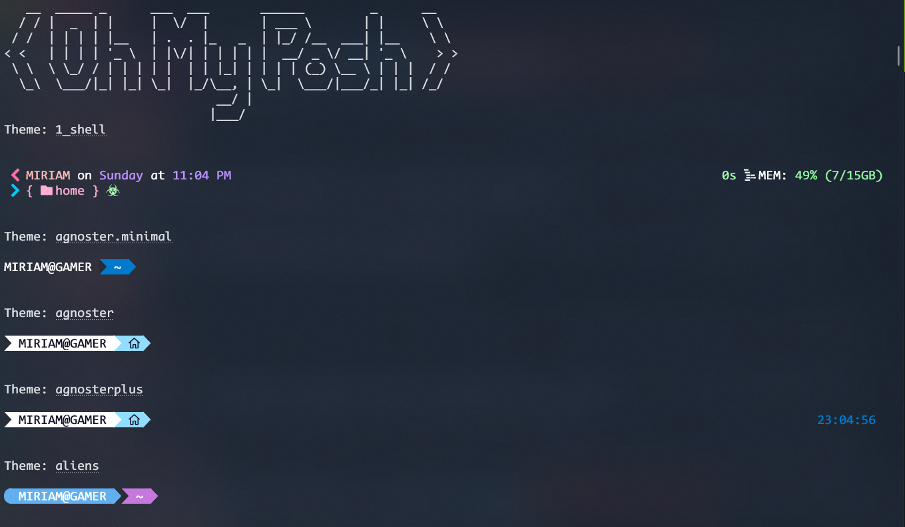
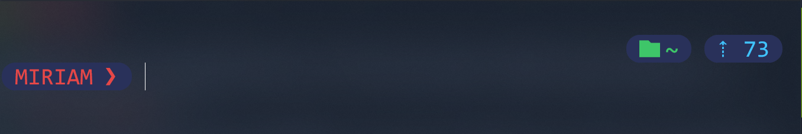

# PowerShell Windows 11

En este repositorio te mostraré como configurar tu Terminal de Windows con PowerShell y Oh My Posh. 

COMENCEMOS!!!

#### Requisistos
- Windows 11
- Terminal
- PowerShell
- Oh My Posh

#### Pasos a seguir

1. Instalar Windows Terminal desde Microsoft Store:

2. Una vez instalada, en la misma Microsoft Store, buscamos: **PowerShell** e instalamos al igual que Windows Terminal:
 

3. Ahora hay que seleccionar a PowerShell como predeterminada, desde la flecha en la parte superior, al lado del más (+) Podemos hacerlo, damos clic y luego en configuraciones para abrir seleccionar las opciones: 

4. Vamos al navegador y escribimos la siguiente liga: [OhMyPosh](https://ohmyposh.dev/docs/installation/windows) lo que nos lleva a la configuración para **Oh My Posh** y seguiremos el primer paso para instalar Oh My Posh

5. Ahora, si se instala correctamente Oh My Posh, en tu caso, te dirá que se ha instalado correctamente, pero falta activarlo:

6. Ahora abrimos una nueva terminal como administrador, esto para instalar una fuente diferente y personalizar la Shell, para buscar la fuente, con las teclas de las flechas es suficiente, una vez encontrada, le damos enter: 

7. Una vez instalada la fuente, cerramos todas las terminales y volvemos a abrir y nos dirigimos a valores predeterminados y luego apariencia, ahí elegimos la fuente que hemos instalado como administradores: 

8. Ahora veamos si hemos instalado Oh My Posh correctamente, si aparece algo como en la imagen, hemos hecho todo bien, en caso contrario regresa al paso 5:

9. Si haz llegado a este paso, ejecutaremos el siguiente comando `oh-my-posh init pwsh --config "$env:POSH_THEMES_PATH\jandedobbeleer.omp.json" | Invoke-Expression` con este comando instalamos el tema que por default Oh My Posh tiene:

10. Nos devolverá otro comando como en la imagen, copialo en la siguiente linea, en automático nos mostrará el tema que hemos instalado:

12. Si deseas elegir otro tema, podemos escogerlo desde la siguiente url [Temas](https://ohmyposh.dev/docs/themes) en mi caso tengo el tema bubblesextra, o si deseas puedes hacerlo por terminal con el comando `Get-PoshThemes` y eliges el que más te guste:

13. Una vez elegido, presionamos **Ctrl + clic** en el tema elegido, para ver el nombre del archivo de las configuraciones del tema, se verá algo así:

14. De regreso en la terminal, presionamos la tecla de la flecha hacia arriba, hasta el comando que copiamos y pegamos en el paso 10, cambiando casi al final del comando, justo donde nos da la ruta del archivo, cambiamos el nombre del tema, que por default el jandedobbeleer.omp.json por el del tema que hemos elegido, el archivo debe terminar con la extensión .json, antes de presionar enter, copiamos ese comando, ahora si enter:

15. Ahora escribimos el siguiente comando `notepad $PROFILE`, si te da un error al intentar abrir el archivo da clic en OK, es entonces donde ejecutas el siguiente comando `New-Item -Path $PROFILE -Type File -Force`, damos enter y nos creará el archivo, volvemos al comando de notepad y se abrirá un bloc de notas, ahí pegamos el comando que copiamos del paso anterior, o en su defecto solo escribimos el comando simple como en la imagen:

16. Guardamos el archivo, y nuestra terminal está casi lista. Cerramos todas las ventanas de Terminal y volvemos abrir para ver la configuración

17. Ahora instalemos los iconos con el siguiente comando `Install-Module -Name Terminal-Icons -Repository PSGallery`:

18. Probablemente te de una alerta por el repositorio de no ser confiable, pero no hay problema, escribimos **A** para instalar todo:

19. Debemos importar lo que hemos instalado con el comando `Import-Module Terminal-Icons` y listamos con el comando `ls` y tal vez te aparezca algo así:

20. De igual forma que el tema lo guardamos en notepad, hacemos lo mismo con los iconos, escribimos de nuevo `notepad $PROFILE` y abajo de nuestro comando anterior escribimos `Import-Module Terminal-Icons` guardamos y cerramos:

21. Ahora cerramos todas las ventanas de la terminal y volvemos a abrir y tu terminal se verá como la haz personalizado bajo tus preferencias: 

Espero que este tutorial te sirva, y si fue funcional, me serviriía que lo destaques con una estrella:

---
### Creador
Tutorial hecho con ❤️ por [Miriam Zamora Morales](https://github.com/MiriamZamoraM). Siempre abierto a colaboraciones, nuevas ideas y retos.
